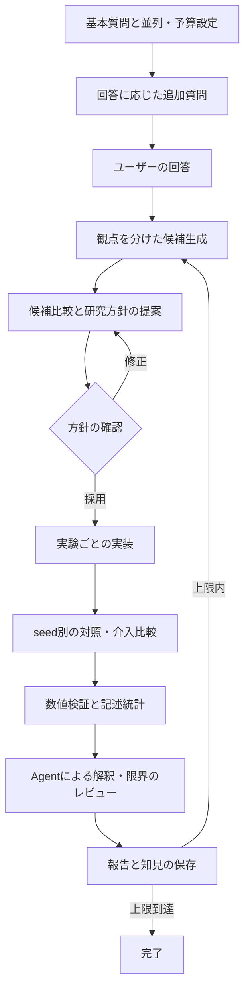

# 汎用化の設計と既存ループとの関係

## v0.4の報告書・スキル育成

research-reportとauto-skill-pipelineを追加し、referencesも再帰的に配置する。
reporting.pyは報告会用Markdownを生成し、完了ゲートで本文保存を検査する。
evolution.pyは候補検出、設計の必須項目・資源の検査、実装のファイル化・unittest実行を担当する。
skill_design/skill_buildジョブを既存の取得・token・再試行・Agent接続に載せる。
設計ハッシュの承認後だけskill_buildを作り、テスト成功版だけをactive_skillsへ登録する。
有効版は該当段階の後続作業票へ反映し、同梱スキルは上書きしない。
再セッションには実験を操作できないimproveモードを追加する。詳細はSKILL_EVOLUTION.md。

## v0.2の入口

clone先にAGENTS.md / CLAUDE.md / GEMINI.md / RESEARCH_START.mdを配置します。
セッション開始時に研究がなければ質問、セットアップ途中なら未回答項目、方針があれば選択メニューを出します。
Pythonやpipを利用者の操作フローに置かず、Agentが同梱agent.pyから直接パッケージを読み込みます。

sessions.pyは研究一覧・方針版・候補・予算の表示とセッションごとの選択を担当し、
agent_entry.pyが未選択・閲覧専用セッションの操作を制限します。
設定変更・候補選び直し・方針修正は新しい研究へ分岐して既存Engineへ接続します。
元の研究の結果とジョブは変更せず、分岐先の計画を改めて提示します。
セッション選択の正本は.research/sessions.sqlite3であり、研究ごとの状態DBと役割を分離します。

## 判断

既存のlab_ex研究ループは、研究方針を扱う上位ループと、実験を実行する下位ループに分かれています。
しかしコードにはGA、VisTex、placebo、seed数、特定の実験ID、GitHubの運用契約への依存があります。
2026-09-04の進捗資料にも未解決の無人運転項目があるため、既存コードをそのまま移植して
汎用環境でも完成済みとする扱いは避けました。

本パッケージは、その設計上の経験を小さな独立ランタイムへ再実装した初期版です。
`src/research_loop`、`.claude/skills`、既存のSTATE、実験・データをimportもコピーもしません。
親リポジトリのGit同期・GitHub Issue作成・Discord接続も動作に必要ありません。
このフォルダ単体を独立したGitHubリポジトリへ移して育てられます。

## 制御の流れ

深掘り・候補・方針・実装・レビューは同じJob契約で実行します。
active方式は起動中のAgentが仕事票を取得・応答し、CLI方式はランタイムが外部Agentへ渡します。
数値実験はAIの自己申告ではなくランタイムがPythonプロセスを起動して結果を読みます。

## 責務と保存先

| 部品 | 責務 |
|---|---|
| config.py | 型・件数・予算・モデル/Agentの役割設定 |
| setup.py / assets | セットアップ、Agent入口と共通スキルの配置 |
| prompts.py | 役割・研究プロファイル・過去結果・JSON出力契約の仕事票 |
| store.py | SQLiteの状態、ジョブ、全試行、イベント |
| engine.py | 状態遷移、方針採用、並列上限、予算、実行、検証、報告 |
| providers.py | シェルを使わないCLI起動とタイムアウト |
| demo.py | 認証不要の、明示的に動作実証用とした応答 |

複数プロセスの仕事取得はSQLiteのトランザクションで直列化し、重複取得と上限超過を防ぎます。
実行はトランザクションの外で行い、完了はjob IDとtokenを照合して確定します。
プロセス停止後のrunningは自動再実行せず、停止確認を伴うrecoverで回収します。
これにより「処理したか不明なものを無条件に再実行する」挙動を避けます。

DBの確定と外部プロセス起動は単一トランザクションにはできません。起動前に予算を予約し、
不明な試行は回収が必要なまま残す方式です。成果物保存直後にクラッシュした場合も、古い試行を
残して新しい試行でやり直します。外部サービスに対する厳密な一度だけの副作用は保証しません。

## 既存機構から継承したこと

| lab_exの概念 | 汎用版の実装 |
|---|---|
| 研究方針と実験実行の二段構造 | planとimplement/executeの分離 |
| next-experiment-proposer / 多観点候補 | 設定件数のideasジョブ、候補ID、選定理由 |
| 事前登録・実行契約 | 提案ハッシュ、対照、主指標、改善幅、停止条件、seed |
| run世代管理・排他 | job/attempt/token、SQLiteによる取得上限 |
| 証跡と実測の照合 | code hash、metrics検証、ログ、Agent review |
| 失敗を隠さない運用 | 失敗試行と途中成果物の保持、failedを含む報告 |
| KB・次サイクル | historyとknowledge.jsonを次の候補作成へ渡す |
| 過大主張の防止 | 未実測・閾値未達のsupportedを拒否、有意差と記述差の区別 |

## 意図的に個別研究へ残したこと

VisTex、FPS正規化、GAクラス、LLM介入、placebo固定、特定の検定方法、18章の報告書などを
全研究共通の条件にはしていません。v0.3では共通4スキルに12の汎用適応スキルを追加しました。
元の全スキルを移植・互換保証したものではありません。

対応の詳細はSKILL_MIGRATION.mdを参照してください。guards.pyが実測照合と本文保存確認、
reporting.pyがMarkdownの知見・分類・履歴・比較・改善候補・問題報告を担当します。
レビュー受理のトランザクション内で必須成果物を保存・照合し、成功後だけ次候補を作ります。
ファイル保存とDB確定は原子的ではないため、失敗時に途中のMarkdownが残る場合があります。
完了の正本はDBのcompletion_gate_passedイベントです。exportで確定済み状態から再生成できます。
completion_gateのハッシュはその時点の文書の記録で、後続サイクルで更新される累積文書の現在値ではありません。

計算・データ分析以外の実行口、多群比較・推測統計、コンテナ、データ台帳、Git連携、
通知・常駐スケジューラは独立プロジェクトで追加する拡張点です。
元の未解決なproduction状態に、このパッケージから操作を加えることはありません。
